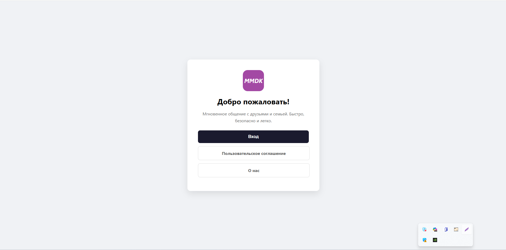
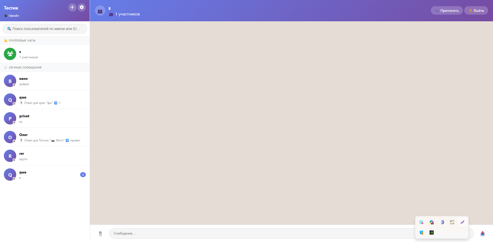
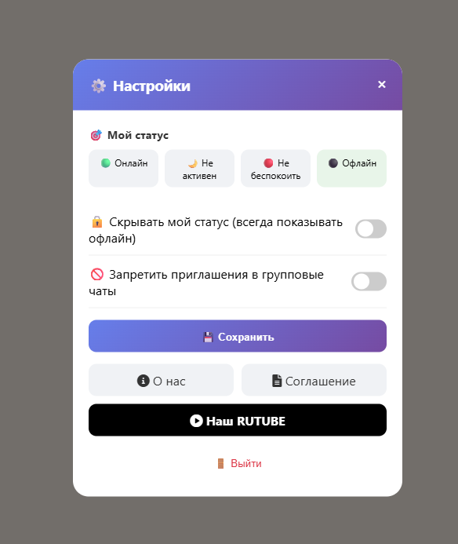

# 💬 MMDK Messenger

<p align="center">
  <kbd><b>🐍 Python</b></kbd>
  <kbd><b>⚡ Flask</b></kbd>
  <kbd><b>🗄 SQLite</b></kbd>
  <kbd><b>🎨 HTML5 / CSS3</b></kbd>
</p>

## 📝 О проекте

**MMDK Messenger** — это веб-приложение для обмена мгновенными сообщениями в реальном времени. Проект реализован на стеке Python (Flask) и чистом клиентском коде (HTML/CSS/JS). Мессенджер поддерживает как личные диалоги, так и групповые комнаты с возможностью передачи медиафайлов.

### 🌟 Ключевой функционал
- 🔐 **Авторизация**: Защищенная регистрация пользователей, система сессий и проработанное пользовательское соглашение.
- 👥 **Групповые чаты**: Создание публичных комнат (каналов) для одновременного общения нескольких участников.
- 🔍 **Умный поиск**: Быстрый поиск собеседников по имени или уникальному идентификатору (ID) в адресной книге.
- 📁 **Обмен медиа**: Возможность прикреплять графические изображения и файлы к сообщениям прямо в чате.
- 🎨 **Кастомный UI/UX**: Полностью кастомный графический интерфейс с уникальным дизайном, боковой панелью навигации и всплывающими окнами (модальными формами).

---

## 📸 Скриншоты интерфейса (Interface)
### Страница авторизации и приветствия
<p align="center">
  
  <br>
  <i>Стартовый экран приветствия: модули авторизации, пользовательского соглашения и информации о проекте</i>
</p>

### Главный экран и групповой чат
<p align="center">
  
  <br>
  <i>Интерфейс активного группового чата, просмотр вложений и боковая панель контактов</i>
</p>

### Настройки профиля и кастомизация
<p align="center">
  
  <br>
  <i>Модальное окно настроек: управление статусом пользователя, приватностью и быстрый переход к внешним ресурсам</i>
</p>

---

## 🛠 Технологический стек

* **Backend:** `Python 3.x`, `Flask` (маршрутизация, обработка запросов)
* **Frontend:** `HTML5`, `CSS3` (Флексбоксы, кастомные переменные для стилей), `JavaScript` (динамическое обновление сообщений)
* **База данных:** `SQLite` (реляционная БД для хранения пользователей, чатов и сообщений)

---

## 🚀 Инструкция по локальному запуску

Для запуска проекта на локальном компьютере выполните следующие шаги:

1. **Клонируйте репозиторий:**
   ```bash
   git clone github.com
   ```
2. **Перейдите в директорию проекта:**
   ```bash
   cd MMDK-messenger
   ```
3. **Установите необходимые зависимости:**
   ```bash
   pip install -r requirements.txt
   ```
4. **Запустите сервер приложения:**
   ```bash
   python app.py
   ```
5. **Откройте приложение в браузере:**
   Перейдите по адресу: [http://192.168.1.31:5100](http://192.168.1.31:5100)

---

## 📅 История разработки (Changelog)

- `05.05` — Разработан и интегрирован фирменный логотип MMDK.
- `27.04` — Финальная стилизация UI, добавление групповых чатов, адресной книги и модуля вложения файлов.
- `22.04` — Разработка логики личных сообщений и сквозного поиска пользователей.
- `16.02` — Обновление и юридическая проработка пользовательского соглашения.
- `12.02` — Добавление пользовательского соглашения, глобальное улучшение UI/UX интерфейса.
- `05.02` — Инициализация проекта, создание базы данных, модулей регистрации и авторизации.
